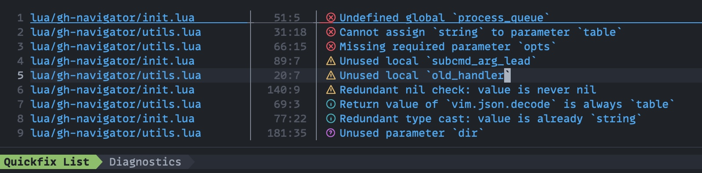

# qf-formatter.nvim

Beautiful quickfix and location list formatting with diagnostic and LSP kind icons.



## 📋 Requirements

- **Neovim 0.10+**
- **[Nerd Font](https://www.nerdfonts.com/)** for icon rendering

## 🛠️ Installation

Install via your preferred plugin manager. The following example uses [lazy.nvim](https://github.com/folke/lazy.nvim).

```lua
{
  'wassimk/qf-formatter.nvim',
  event = 'VeryLazy',
  opts = {}
}
```

## 💻 Features

- Formatted quickfix and location list entries: `filename │line:col│ [icon] text`
- Truncates long filenames with ellipsis
- Replaces `$HOME` with `~` in file paths
- Diagnostic icons for error, warning, info, and hint entries
- LSP kind icons (codicons) for document symbol entries
- Syntax highlighting for filenames, separators, line numbers, diagnostics, and LSP kinds

## 🔧 Configuration

The `setup()` function accepts an options table. All values are optional.

```lua
require('qf-formatter').setup({
  filename_width = 32, -- max filename column width (default: 32)
})
```

### Highlight Groups

All highlights are defined with `default = true`, so your colorscheme always takes priority. Every group is prefixed with `QfFormatter` so you can customize the quickfix appearance without affecting the rest of Neovim.

**Quickfix structure:**

| Group | Default Link | Description |
|-------|-------------|-------------|
| `QfFormatterFilename` | `Directory` | Filename column |
| `QfFormatterSeparator` | `Delimiter` | `│` separators |
| `QfFormatterLineNr` | `LineNr` | Line and column numbers |

**Diagnostic icons:**

| Group | Default Link |
|-------|-------------|
| `QfFormatterError` | `DiagnosticSignError` |
| `QfFormatterWarn` | `DiagnosticSignWarn` |
| `QfFormatterInfo` | `DiagnosticSignInfo` |
| `QfFormatterHint` | `DiagnosticSignHint` |

**LSP kind icons:**

| Group | Default Link |
|-------|-------------|
| `QfFormatterKindClass` | `Type` |
| `QfFormatterKindColor` | `Special` |
| `QfFormatterKindConstant` | `Constant` |
| `QfFormatterKindConstructor` | `Function` |
| `QfFormatterKindEnum` | `Type` |
| `QfFormatterKindEnumMember` | `Constant` |
| `QfFormatterKindEvent` | `Special` |
| `QfFormatterKindField` | `Identifier` |
| `QfFormatterKindFile` | `Directory` |
| `QfFormatterKindFolder` | `Directory` |
| `QfFormatterKindFunction` | `Function` |
| `QfFormatterKindInterface` | `Type` |
| `QfFormatterKindKeyword` | `Keyword` |
| `QfFormatterKindMethod` | `Function` |
| `QfFormatterKindModule` | `Include` |
| `QfFormatterKindOperator` | `Operator` |
| `QfFormatterKindProperty` | `Identifier` |
| `QfFormatterKindReference` | `Identifier` |
| `QfFormatterKindSnippet` | `Special` |
| `QfFormatterKindStruct` | `Type` |
| `QfFormatterKindText` | `String` |
| `QfFormatterKindTypeParameter` | `Type` |
| `QfFormatterKindUnit` | `Number` |
| `QfFormatterKindValue` | `Number` |
| `QfFormatterKindVariable` | `Identifier` |

To customize any group, override it in your config:

```lua
vim.api.nvim_set_hl(0, 'QfFormatterFilename', { fg = '#82aaff' })
vim.api.nvim_set_hl(0, 'QfFormatterKindMethod', { link = 'BlinkCmpKindMethod' })
```

## 🔧 Development

Run tests and lint:

```shell
make test
make lint
```

Enable the local git hooks (one-time setup):

```shell
git config core.hooksPath .githooks
```

This activates a pre-commit hook that auto-generates `doc/qf-formatter.nvim.txt` from `README.md` whenever the README is staged. Requires [pandoc](https://pandoc.org/installing.html).
